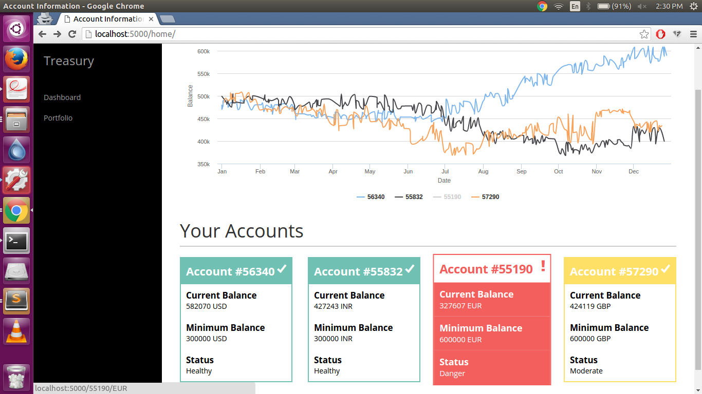
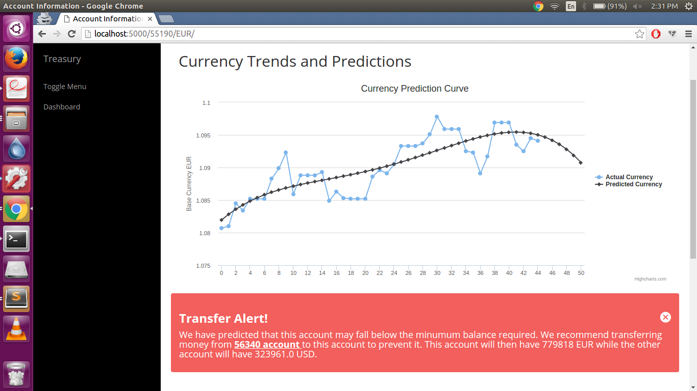
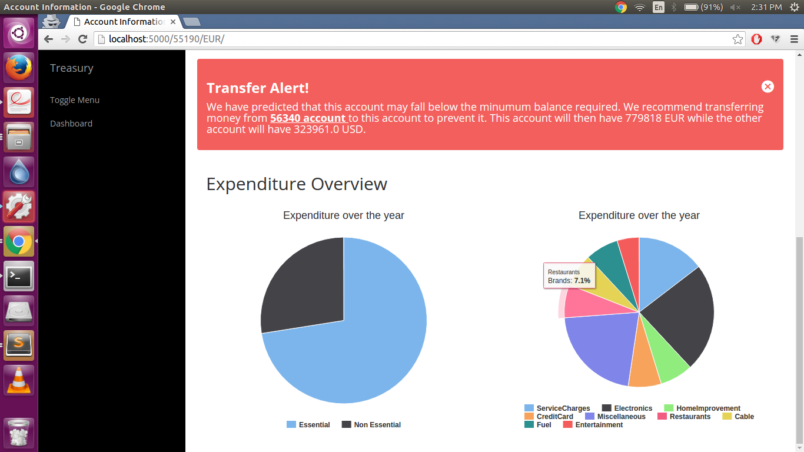
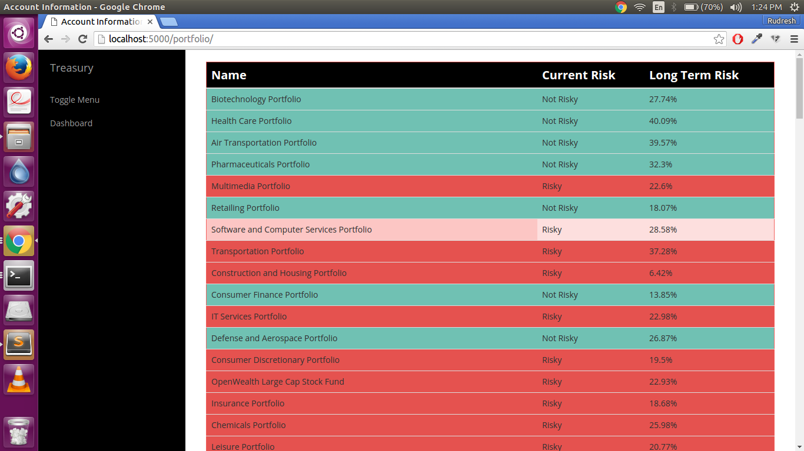
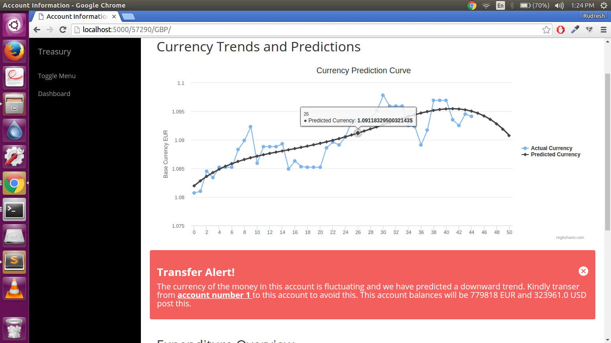

# Rise Hackathon

An app that we built at Barclays Rise Hackathon 2016.

This Web-App won the Yodlee-Envestnet partner prize.

## Features

-Regressional Analysis of past balances.

-Prediction of a downfall in balance in an account.

-Automatic balance transfer tips and suggestions in case of the above.

-Currency trend/volatility analysis.

-Automatic currency conversion schema sugesstions.

-Analysis of spending patterns leveraged by IBM Watson. 

-Portfolio Safe/Unsafe investment suggestions, powered by Watson Analytics.

## Screenshots

